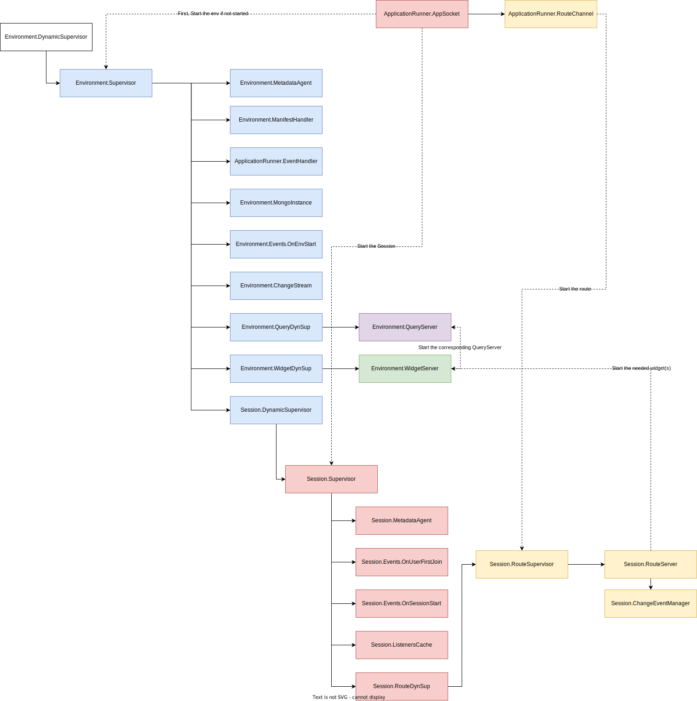
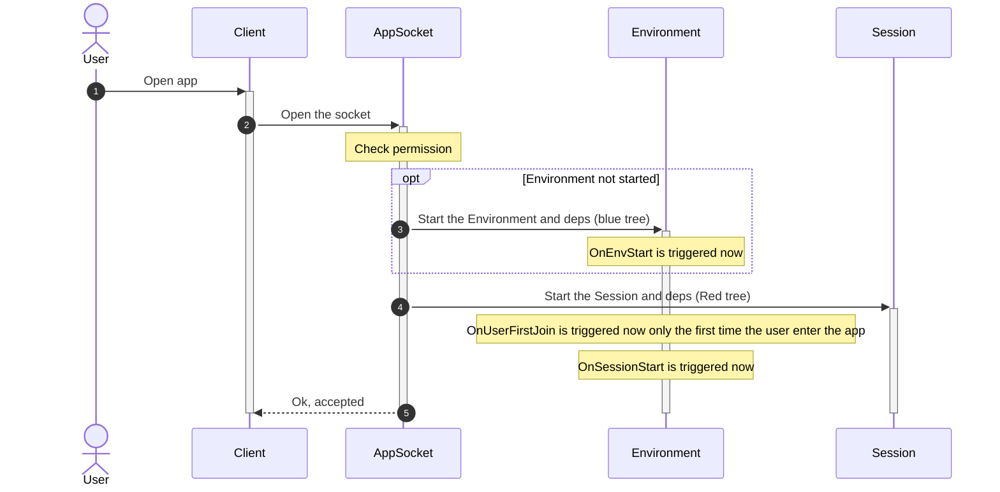
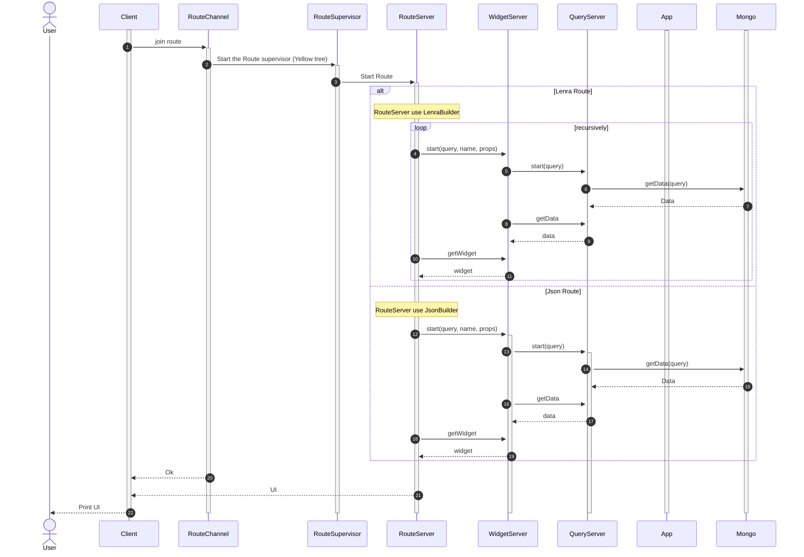
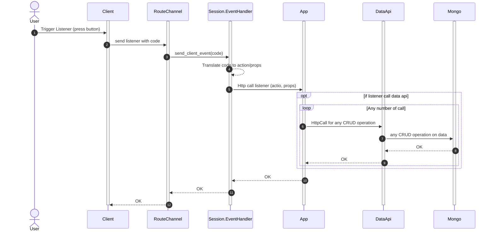
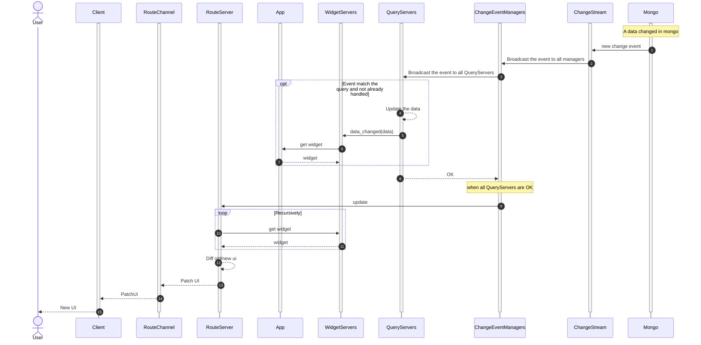

# How does ApplicationRunner works ?

## General tree organisation
### The Environment Tree
The Blue part is the environment tree. It exists only once per environment.
An environment is a specific instance of an app with its own data.
Multiple environments can be created for one app. They behave like two app with two databases.

If the environment stop (if unused enought time) it is restarted when a session is asked to be oppened first.

TODO : Explain the full blue tree

### The Session Tree
The red part is the Session Tree. It exists once per user session and lives in an environment
One user can open multiple sessions. 
A session is defined by a unique ID (UUID).

A session can be stopped after a long inactivity time.
If it's the case, the client will open a new session (new socket connexion)

TODO : Explain the full red tree

### The Route tree
The yellow part is the Route Tree. It exists once per route and lives in a session.
A route is basically a UI/JSON that lives under a URI.
For example, the route **/users/42** could display a specific user information (for the Lenra UI) or return a specific JSON (for the JSON routes)

## Start the app
### Socket initialization (simplified)

When the socket is initialized (when the user join the app), we also start the Session (Red tree) and the Environment (Blue tree) if it is not started.

### New Route Channel (simplified)

When the client open a new route, we start the corresponding RouteSupervisor (Yellow tree)
It directly trigger a UI push in this route channel.

## App lifecycle

### When a listener is called (simplified)

When the user interact with the UI, listeners can be sent to the Server.
When a listener is sent, the server will call the App listener to let the app interact with the data.

### When a data change in mongo (simplified)

Generally during a listener call, the mongo data will change.
When this happen, the UI automatically updates.

