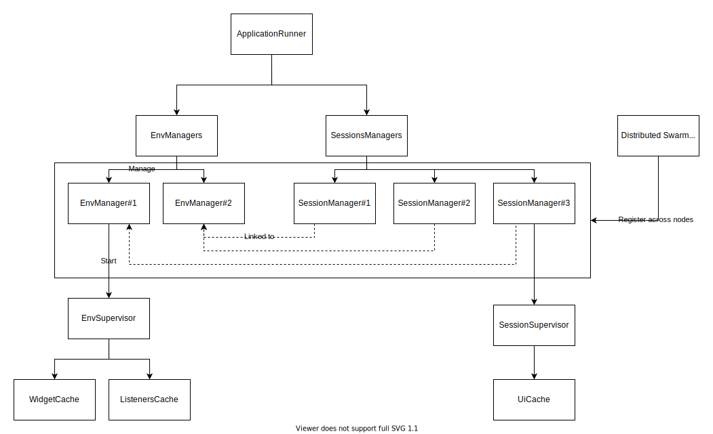
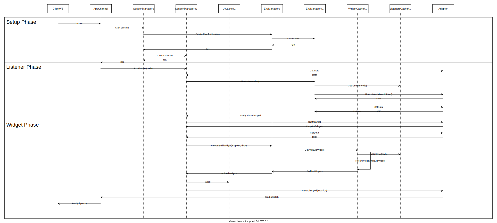

# The Environment and Session achitecture

## How does it works ?
We tried to organize each actor in the system with elixir process/genserver.
These are the actors in the system.
- An Environment is a specific version of an app. The Environment handle everything that is in common between every users of one version of the application (The cache of all widget for example.)
- A session is a device open in a specific App. The session is linked to the Environment and handle all IN/OUT between the client socket and the Environment. The session handle everyhting that is specific to a user (the state of the UI for example.)

To match these two actor and everything they handle, we use GenServer, DynamicSupervisor and Supervisor.
- An environment is materialized with a `EnvManager`
- All environments are supervised by a DynamicSupervisor `EnvManagers`
- An `EnvManager` need submodules to handle different features. These modules are handled by `EnvSupervisor`
And for the sessions :
- A session is materialized with a `SessionManager` GenServer.
- All sessions are supervised by a DynamicSupervisor `SessionManagers`
- A `SessionManager` need submodules to handle different features (cache for example). These modules are handled by the `SessionSupervisor`

All the `SessionManager` and `EnvManager` are registered by a distributed registry : `Swarm`. This ensure that every Session and every Environment are only created once across all nodes of the cluster.

## A fiew design notes :
- The `EnvManager` have an `EnvState` internal state
- The `SessionManager` have a `SessionState` internal state
- The `SessionManager` handle every In/Out external API.
- We should NOT directly call the `EnvManager`.
- The `SessionManager` are linked to them `EnvManager`
- If the `EnvManager` is stopped, all the `SessionManager` are stopped too.
- The `SessionManager` is stopped after 10 min of inactivity (see config file.)
- The `EnvManager` is stopped after 60 min of inactivity (see config file.)

## Sequence diagram from the client call to the UI response.
