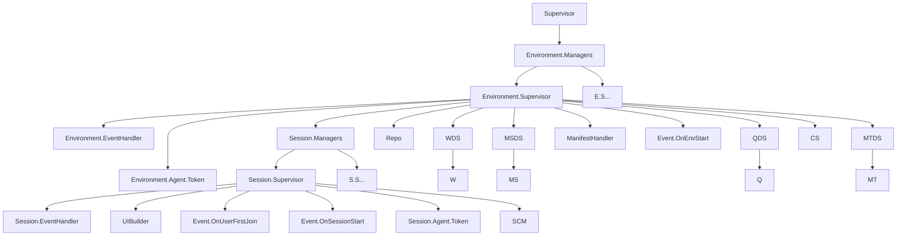

## Applicationrunner Genserver tree

This doc regroupe documentation about all Genserver present in ApplicationRunner for Environmnent/Session/MongoDB

with:

- **Supervisor**: the Applicationrunner supervisor
- **Environment.Managers**: The Environments dynamic supervisor
- **Environment.Supervisor**: The Environment supervisor that start env and all needed genserver
- **Session.Managers**: The Sessions dynamic supervisor
- **Session.Supervisor**: The Session supervisor that start session and all needed genserver
- QDS: **Query dynamic supervisor**, which starts Q, Q will be placed in the swarm group by the session.
- CS: **Change Stream**  
    - Started by Environment.Supervisor
    - Stopped by Environment.Supervisor
    - Notify `{:scm, env_id}`
    - timeout after X min
    - Jobs: 
        - Notify session change manager on mongo event
- SCM: **Session Change Manager**
    - In swarm group `{:scm, env_id}` 
    - Delete swarm group
    - Call all `{:query, session_id}`
    - Jobs:
        - Listen for message in `{:scm, env_id}` and call all `{:query, session_id}`
        - After all Query respond notify UiBuilder to rebuild 
- Q: **Query**, which listens to the swarm messages sent by QSD and notifies W if the data has changed.
    - Started by Widget
    - Stopped Automatically after timeout 
    - Timeout after 10 min
    - In multiple `{:query, session_id}` groups
    - named with `{:via, :swarm, {__MODULE__, env_id, coll, query}}`
    - Jobs: 
        - called by SCM with Mongo Event, check if change impact query
        - If change concern data notify Widget to rebuild with message `{:data_changed, new_data}`
        - If not respond :ok to SCM
- **UiBuilder**: Genserver that cache last ui and build new ui with widget cache
    - Started by session.supervisor
    - Stopped by session.supervisor
    - Called from SCM
    - Jobs: 
        - On startup build first ui and send it to client
        - On changed event rebuild ui (start new widget if needed) send diff with cached ui
        - Saved the UI for next send
- WDS: **Widget dynamic supervisor**, starts the widget.
    - dynamically start widget, requested by UiBuilder
- W: **Widget**, cache the widget interface, and listen to Q to rebuild if necessary.
    - Started by UiBuilder
    - Stopped by UiBuilder
    - In group `{:widget, env_id, coll, query}`
    - Timeout after X min
    - Jobs:
        - On startup buid ui first time
        - Listene to Query event to rebuild
- **MongoRepo**: a repository conncted to one mongo database.
    - Each environment got her own database
    - We have One MongoRepo genserver started by Environment
- MSDS: **Mongo Session Dynamic Supervisor**, start the Mongo session
- MS: **Mongo Session**, a session is started for each listener and stops when the listeners end.
- MTDS : **Mongo transaction dynamic supervisor**
- MT: **Mongo Transaction**, started by a request from the application and linked to a mongo session. 